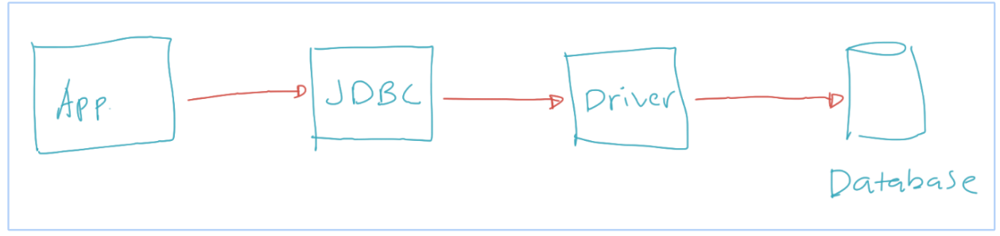

# Pengenalan JDBC

- JDBC singkatan dari Java Database Connectivity
- JDBC merupakan spesifikasi API standard untuk mengakses database di Java 
- JDBC tidak bisa langsung digunakan, karena isinya hanyalah interface-interface kontrak untuk berinteraksi dengan database 
- JDBC perlu implementasi, atau kita sebut dengan Driver, seperti MySQL Driver, PostgreSQL Driver, OracleDB Driver, dan lain-lain 
- Semua interface API JDBC terdapat di package java.sql dan javax.sql 
- https://docs.oracle.com/en/java/javase/15/docs/api/java.sql/java/sql/package-summary.html  
- https://docs.oracle.com/en/java/javase/15/docs/api/java.sql/javax/sql/package-summary.html  

# Cara Kerja JDBC

# MySQL

- Pada materi kali ini kita akan menggunakan MySQL sebagai database
- Jadi pastikan teman-teman sudah mengerti tentang datatabase MySQL 
