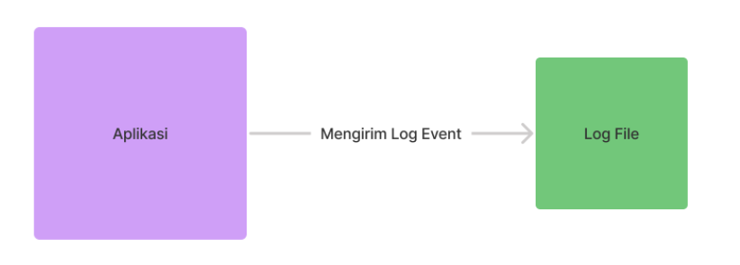
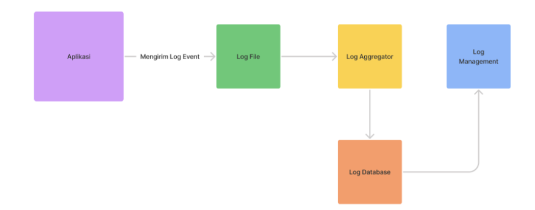
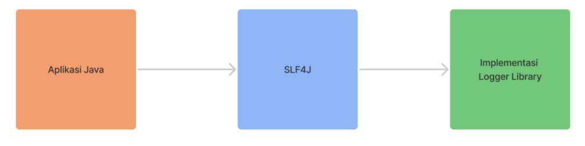

# Pengenalan Logging

- Log file adalah file yang berisikan informasi kejadian dari sebuah sistem
- Biasanya dalam log file, terdapat informasi waktu kejadian dan pesan kejadian 
- Logging adalah aksi menambah informasi log ke log file 
- Logging sudah menjadi standard industri untuk menampilkan informasi yang terjadi di aplikasi yang kita buat 
- Logging bukan hanya untuk menampilkan informasi, kadang digunakan untuk proses debugging ketika terjadi masalah di aplikasi kita 

## Diagram Logging

## Ekosistem Logging

# Logging Library

## Java Logging

- Java sendiri sebenarnya memilih package yang dikhususkan untuk logging
- Namun saat ini, kebanyakan programmer tidak menggunakannya 
- Hal ini dikarenakan penggunaannya yang kurang flexible 
- https://docs.oracle.com/javase/8/docs/api/java/util/logging/package-summary.html  

## Logging Library

- Diluar Java Logging, banyak sekali library yang bisa kita gunakan untuk logging, seperti :
  - Apache Common Log 
  - Apache Log4J 
  - Logback 
  - dan lain-lain 

## SLF4J

- Pada kelas ini kita akan menggunakan SLF4J
- SLF4J merupakan framework logging yang digunakan seperti API, dimana kita bisa berganti-ganti implementasi logging framework nya 
- SLF4J banyak sekali digunakan oleh programmer karena sangat flexible untuk berganti-ganti library logging, tanpa harus melakukan perubahan di kode program nya 
- Kita hanya perlu memilih library yang akan digunakan, dan secara otomatis SLF4J akan menggunakan implementasi library tersebut 
- http://www.slf4j.org/  

## Diagram SLF4J

## Logback

- Untuk implementasi library logging nya, kita akan menggunakan Logback
- Logback merupakan salah satu library logging yang populer di Java 
- Terutama Logback digunakan secara default di framework Spring Boot, salah satu framework paling populer di Java 
- http://logback.qos.ch/
