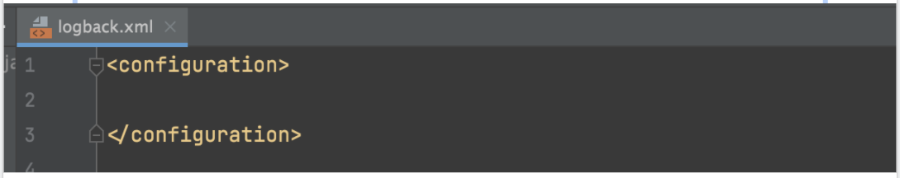
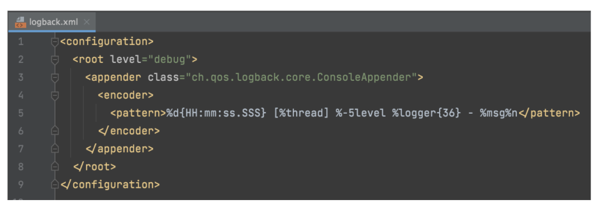
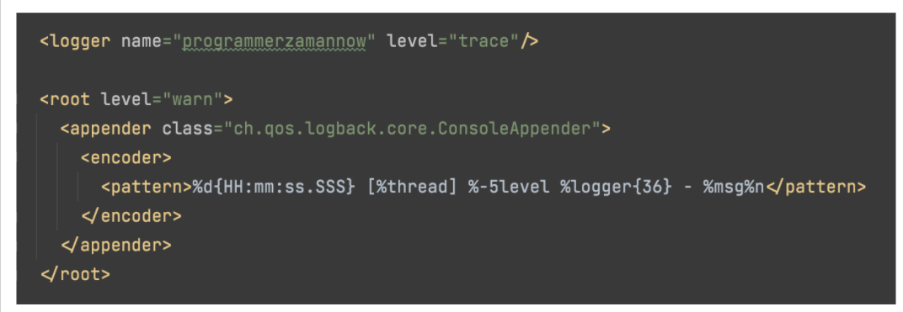

# logback.xml

- Logback akan membaca konfigurasi dari file logback.xml yang terdapat di default package
- Artinya kita butuh membuat file logback.xml pada default package 

# Level Configuration

- Secara default, saat kita membuat file konfigurasi, logback akan membaca level yang harus dikeluarkan dari file logback
- Jika tidak ada, maka otomatis tidak akan keluar 
- Oleh karena itu, hal pertama yang perlu kita lakukan adalah, menambahkan logger level, untuk memberitahu level mana yang ingin kita keluarkan di log file 
- https://gist.github.com/khannedy/e2ec8fcb20344523f3d9e2a8fcc108d7  

# Logger Package

- Kadang kita ingin membuat logging level berbeda-beda untuk package
- Misal untuk package framework, kita ingin gunakan warn, tapi untuk package aplikasi kita, kita ingin gunakan info 
- Secara default, sebelumnya kita sudah buat root, root adalah default fallback semua package level ketika tidak dibuatkan konfigurasi secara spesifik 
- Namun jika kita ingin, kita juga bisa membuat logger level lebih dari satu 
- Tinggal gunakan prefix package nya saja, artinya semua package di dalamnya akan ikut logger level tersebut 
- https://gist.github.com/khannedy/63ac69c2be341c02d4b0a28e19490639  

