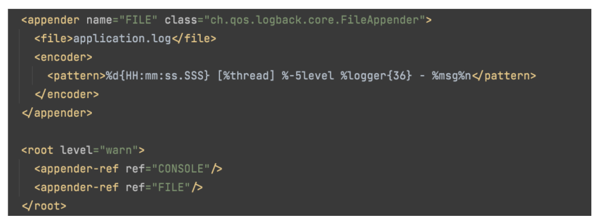
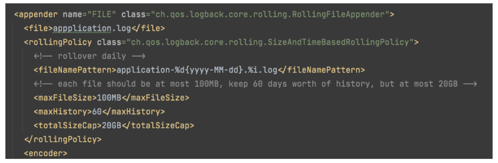

# Appender

- Saat kita melakukan logging, kita bisa menentukan destinasi log file yang akan dibuat, atau dinamakan Appender
- Logback sudah menyediakan banyak sekali appender, jadi sebenarnya kita tidak perlu membuat appender secara manual
- http://logback.qos.ch/apidocs/ch/qos/logback/core/Appender.html

# Console Appender

- Appender yang paling sederhana adalah Console
- Dimana appender ini hanya meneruskan log event yang kita kirim menggunakan logger ke dalam console atau System.out
- ConsoleAppender sangat cocok ketika aplikasi yang kita buat di bungkus dalam docker atau kubernetes misalnya, karena
  kita cukup menampilkannya di console, dan secara otomatis log bisa diambil oleh docker dan kubernetes

# File Appender

- FileAppender merupakan appender yang mengirim log event ke file
- FileAppender sangat cocok ketika kita masih menggunakan VM untuk deploy aplikasi  kita
- Jadi semua log event akan disimpan di file
- https://gist.github.com/khannedy/6afed2b90e55fd2b66b7d7d0a6d6a0ad

# Rolling File Appender

- Kadang saat menyimpan semua log event di file, lama-lama file tersebut akan terlalu besar
- Logback menyediakan RollingFileAppender, yaitu appender yang menyimpan data nya di file, namun kita bisa lakukan rolling, artinya per waktu tertentu akan dibuatkan file baru 
- Selain itu kita bisa juga set maksimal ukuran file nya, sehingga ketika sudah mencapai batas maksimal, akan dibuatkan file baru lagi 
- Ini lebih direkomendasikan untuk digunakan dibanding menggunakan FileAppender 
- https://gist.github.com/khannedy/f128a692bc00102503eaee6a44838720 

# Dan Masih Banyak Appender Lainnya

- DBAppender http://logback.qos.ch/apidocs/ch/qos/logback/classic/db/DBAppender.html 
- OutputStreamAppender http://logback.qos.ch/apidocs/ch/qos/logback/core/OutputStreamAppender.html  
- SMTPAppender http://logback.qos.ch/apidocs/ch/qos/logback/classic/net/SMTPAppender.html  
- SockerAppender http://logback.qos.ch/apidocs/ch/qos/logback/classic/net/SocketAppender.html  
- SyslogAppender http://logback.qos.ch/apidocs/ch/qos/logback/classic/net/SyslogAppender.html  
